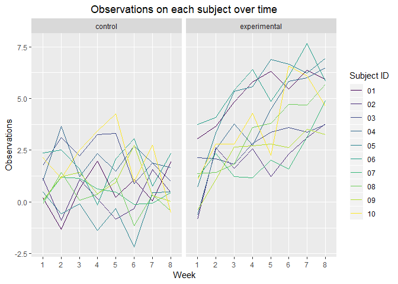

P8105\_hw5\_sy2825
================
Shuo Yan (sy2825)
2018-11-06

Poblem 1
========

First, let's import data and create a tidy dataframe containing data from all participants.

``` r
file_names = list.files(path = "./data", pattern = ".*csv")

file_data = map(file_names, ~ read.csv(file.path("./data", .)))

longitudinal_data = tibble(name = str_replace(file_names, ".csv", "")) %>%
  mutate(file_data = file_data) %>%
  unnest() %>%
  janitor::clean_names() %>%
  gather(key = week, value = observations, week_1:week_8) %>%
  mutate(week = str_replace(week, "week_", "")) %>%
  separate(name, into = c("arm", "id"), sep = "_") %>%
  mutate(arm = str_replace(arm, "con", "control")) %>%
  mutate(arm = str_replace(arm, "exp", "experimental"))

# Now we have a tidied dataframe :

longitudinal_data
```

    ## # A tibble: 160 x 4
    ##    arm     id    week  observations
    ##    <chr>   <chr> <chr>        <dbl>
    ##  1 control 01    1             0.2 
    ##  2 control 02    1             1.13
    ##  3 control 03    1             1.77
    ##  4 control 04    1             1.04
    ##  5 control 05    1             0.47
    ##  6 control 06    1             2.37
    ##  7 control 07    1             0.03
    ##  8 control 08    1            -0.08
    ##  9 control 09    1             0.08
    ## 10 control 10    1             2.14
    ## # ... with 150 more rows

The following is the spaghetti plot showing observations on each subject over time :

``` r
ggplot(longitudinal_data, aes(x = week, y = observations, group = id, color = id)) +
  geom_path() + 
  labs(title = "Observations on each subject over time",
       x = "Week",
       y = "Observations") + 
  viridis::scale_color_viridis(
    name = "Subject ID", 
    discrete = TRUE) +
  facet_grid(. ~ arm) +
  theme(plot.title = element_text(hjust = 0.5))
```



From the plot we can see that the observation values of experimental group are mostly higher than the observation values of control group. Also, the observation values of experimental group tend to increase over time.

Problem 2
=========

First, let's import and describe the raw data.

``` r
url = "https://raw.githubusercontent.com/washingtonpost/data-homicides/master/homicide-data.csv"

washington_post_data = read.csv(url)

setNames(
data.frame(colnames(washington_post_data)),
c("variable name")
)
```

    ##    variable name
    ## 1            uid
    ## 2  reported_date
    ## 3    victim_last
    ## 4   victim_first
    ## 5    victim_race
    ## 6     victim_age
    ## 7     victim_sex
    ## 8           city
    ## 9          state
    ## 10           lat
    ## 11           lon
    ## 12   disposition

The raw data is a data with dimension 52179, 12. It includes 12 distinct variales that can describe the information about case id, case reported date, case location (city, state, latitude, and lontitude), disposition, and also victim's name (last name and first name), race , age, and sex.

Now let's tidy the data.

``` r
tidy_washington_post_data = washington_post_data %>%
  janitor::clean_names() %>%
  mutate(city_state = paste(washington_post_data$city, washington_post_data$state, sep = ", ")) %>%
  group_by(city_state)

summarize(tidy_washington_post_data, total_homicides = n(), total_unsolved_homicides = sum(disposition %in% c("Closed without arrest", "Open/No arrest")))
```

    ## # A tibble: 52 x 3
    ##    city_state      total_homicides total_unsolved_homicides
    ##    <chr>                     <int>                    <int>
    ##  1 Albuquerque, NM             378                      146
    ##  2 Atlanta, GA                 973                      373
    ##  3 Baltimore, MD              2827                     1825
    ##  4 Baton Rouge, LA             424                      196
    ##  5 Birmingham, AL              800                      347
    ##  6 Boston, MA                  614                      310
    ##  7 Buffalo, NY                 521                      319
    ##  8 Charlotte, NC               687                      206
    ##  9 Chicago, IL                5535                     4073
    ## 10 Cincinnati, OH              694                      309
    ## # ... with 42 more rows

The above table shows the total number of homicides and the number of unsolved homicides for each city.
